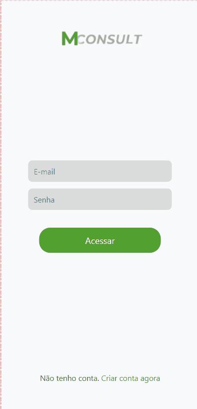
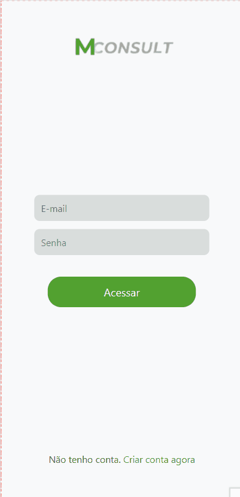

# 🩺 Mconsult

**Uma solução FullStack para o agendamento e gerenciamento de consultas.**  

---

## ✨ Sobre o Projeto  

O **Mconsult** é uma plataforma FullStack projetada para simplificar o agendamento e a gestão de consultas em clínicas particulares. Com um sistema centralizado, permite que clientes agendem consultas de maneira intuitiva, enquanto fornece aos médicos e gestores ferramentas eficientes para gerenciamento de horários e consultas.

---

## 🌟 Funcionalidades  

- **Agendamento de Consultas**: Uma interface simples para clientes.
- **Gestão de Consultas**: Controle completo para médicos e gestores via interface web (em desenvolvimento).
- **Compatibilidade Multi-Plataforma**:  
   - Aplicativo mobile para clientes.
   - Interface web para médicos e administradores.
   - API Rest para integração e operações backend.  
- **Suporte a SQL Server** (e projetado para outros bancos relacionais).  
- **Segurança**: Autenticação com JWT e senhas protegidas com bcrypt.
- **Futuro**: Integração com sistemas de comunicação e gerenciamento de filas.

---

## 🛠️ Tecnologias  

O projeto utiliza as seguintes tecnologias e ferramentas:  

- **Frontend**: React, React Native, Expo.  
- **Backend**: Node.js, Express, Prisma.  
- **Linguagem**: TypeScript.  
- **Banco de Dados**: SQL Server (com planos para suportar outros).  
- **Documentação**: Swagger para API Rest.  

---

## 🚀 Público-Alvo  

O **Mconsult** é direcionado a clínicas particulares de pequeno e médio porte, ajudando-as a oferecer uma experiência de agendamento moderna e centralizada para seus clientes.  

---

## 📋 Pré-requisitos  

### Backend  
- **Node.js**: Versão compatível com ES2019 e CommonJS.  
- **Gerenciador de Pacotes**: NPM ou Yarn.  

#### Dependências:
```json
{
  "@prisma/client": "^5.21.1",
  "bcrypt": "^5.1.1",
  "cors": "^2.8.5",
  "date-fns": "^4.1.0",
  "dotenv": "^16.4.5",
  "express": "^4.21.1",
  "jsonwebtoken": "^9.0.2",
  "swagger-autogen": "^2.23.7",
  "swagger-ui-express": "^5.0.1",
  "ts-node": "^10.9.2",
  "uuid": "^11.0.2"
}
```

---

## 🔧 Como Configurar  

### Backend
1. Clone o repositório:  
   ```bash
   git clone https://github.com/seu-usuario/mconsult.git
   ```
2. Acesse o diretório:  
   ```bash
   cd mconsult/mconsult-api
   ```
3. Instale as dependências:  
   ```bash
   npm install
   ```
4. Configure as variáveis de ambiente no arquivo `.env`. Exemplo:
   ```
   DATABASE_URL="sua-url-do-banco"
   JWT_SECRET="sua-chave-secreta"
   JWT_EXPIRES="tempo para inspiração no formato quantidade de horas mais a letra 'h' (Ex.: 1h, 24h, 72h)"
   ```
5. Rode as migrações do Prisma:  
   ```bash
   npx prisma migrate dev
   ```
5. Gere a documentação do Swagger:  
   ```bash
   npm run docs
   ```
7. Inicie o servidor:  
   ```bash
   npm run start:dev
   ```

---

## 🛣️ Roadmap  

- [x] Backend e API Rest concluídos.  
- [x] App mobile funcional para clientes.  
- [ ] Interface web para médicos e administradores.  
- [ ] Sistema de gerenciamento de filas.  
- [ ] Integração com notificações e mensagens.  

---

## 🤝 Como Contribuir  

Quer contribuir com o projeto? Siga estas etapas:  

1. Faça um fork do repositório.  
2. Crie uma branch para sua funcionalidade:
 ```bash
git checkout -b feature/nova-funcionalidade
```  
3. Commit suas mudanças: 
```bash
git commit -m 'Adiciona nova funcionalidade'
```
4. Faça um push para a branch 
```bash
git push origin feature/nova-funcionalidade
```  
5. Abra um Pull Request.  

 Contribuições são muito bem-vindas!

---

## 📄 Licença  

Licença Apache 2.0

---

## 📷 Imagens e Demonstrações  


### 📱 Criando conta no Aplicativo móvel


### 📱 Acessando o Aplicativo móvel


### 📱 Agendando uma consulta no Aplicativo móvel


### 📱 Cancelando uma consulta no Aplicativo móvel
